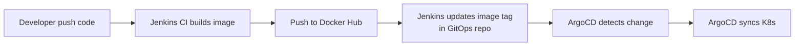

# 🚀 Hướng Dẫn Chi Tiết Project 2: Xây Dựng Hệ Thống CI/CD cho YAS

## Mục lục
1. [Tổng quan đề bài & Đánh giá tài nguyên](#1-tổng-quan)
2. [Chuẩn bị môi trường GCP](#2-chuẩn-bị-gcp)
3. [Thiết lập K8s Cluster](#3-thiết-lập-k8s-cluster)
4. [Cài đặt & cấu hình Jenkins](#4-cài-đặt-jenkins)
5. [Fork & Push Docker Images lên Docker Hub](#5-chuẩn-bị-docker-images)
6. [Viết K8s Manifests cho YAS](#6-viết-k8s-manifests)
7. [Pipeline CI - Build image theo commit ID](#7-pipeline-ci)
8. [Job developer_build - Deploy theo branch](#8-job-developer-build)
9. [Job Cleanup - Xoá triển khai](#9-job-cleanup)
10. [Job Dev & Staging (câu 6)](#10-job-dev-staging)
11. [Nâng cao: ArgoCD](#11-nâng-cao-argocd)
12. [Nâng cao: Service Mesh (Istio)](#12-nâng-cao-service-mesh)
13. [Viết báo cáo](#13-viết-báo-cáo)

---

## 1. Tổng quan

### Đề bài yêu cầu (6 điểm cơ bản)
| # | Yêu cầu | Mô tả |
|---|---------|-------|
| 1 | Images mặc định | Dùng image tag `main`/`latest` cho tất cả services. KHÔNG cần Grafana/Prometheus |
| 2 | K8s Cluster | 1 Master + 1 Worker (hoặc Minikube) |
| 3 | CI Pipeline | Mỗi branch, khi commit → build image với tag = **commit ID cuối**, push lên Docker Hub |
| 4 | Job `developer_build` | Developer chọn branch cho từng service → deploy lên K8s. Service khác dùng tag `main` |
| 5 | Job Cleanup | Xoá deployment ở mục 4 |
| 6 | Job Dev + Staging | Dev: auto deploy khi main thay đổi. Staging: phát hiện tag release (v1.2.3) → build & deploy |

### Nâng cao (4 điểm)
- **ArgoCD (2đ)**: Thay thế mục 6, dùng ArgoCD cho dev & staging
- **Service Mesh (2đ)**: mTLS, authorization policy, retry policy trên Istio + Kiali

### 💻 Đánh giá tài nguyên: 4 vCPU / 32GB RAM / 50GB SSD

> [!IMPORTANT]
> **KẾT LUẬN: ĐỦ TÀI NGUYÊN**, nhưng cần tối ưu cẩn thận.

| Component | RAM ước tính | Ghi chú |
|-----------|-------------|---------|
| K8s Control Plane (kubeadm) | ~1.5 GB | etcd, apiserver, controller, scheduler |
| Jenkins | ~1-2 GB | Với 1-2 pipeline chạy |
| Keycloak | ~0.5-1 GB | Identity server |
| PostgreSQL | ~0.5 GB | Shared cho tất cả services |
| Kafka + Zookeeper | ~1-1.5 GB | Message broker |
| Redis | ~0.1 GB | Session store |
| Nginx Ingress | ~0.1 GB | Proxy |
| 16 YAS Microservices (Java Spring) | ~8-12 GB | Mỗi service ~0.5-0.7 GB |
| **Tổng** | **~14-19 GB** | Còn ~13-18 GB buffer |

> [!WARNING]
> **SSD 50GB** là giới hạn quan trọng nhất! Docker images sẽ chiếm nhiều dung lượng.
> - Thường xuyên chạy `docker system prune -af` để dọn image cũ
> - Dùng `kubectl get nodes -o wide` kiểm tra disk usage
> - Cân nhắc chỉ deploy **6-8 core services** thay vì tất cả 16 services

### Chiến lược tiết kiệm tài nguyên
1. **Dùng 1 node duy nhất** (Master + Worker kết hợp bằng `kubectl taint`) thay vì 2 node
2. **Giới hạn resources** cho mỗi pod: `requests: 128Mi`, `limits: 512Mi`
3. **Replicas = 1** cho tất cả
4. **Không deploy Observability** (Grafana/Prometheus/Loki/Tempo) → tiết kiệm ~4GB RAM

---

## 2. Chuẩn bị GCP

### 2.1 Tạo VM Instance

```bash
# Trên GCP Console hoặc gcloud CLI
gcloud compute instances create yas-k8s-node \
  --machine-type=e2-standard-4 \
  --boot-disk-size=50GB \
  --boot-disk-type=pd-ssd \
  --image-family=ubuntu-2204-lts \
  --image-project=ubuntu-os-cloud \
  --zone=asia-southeast1-a \
  --tags=k8s-node
```

### 2.2 Mở Firewall

```bash
# Mở ports cần thiết
gcloud compute firewall-rules create k8s-allow-nodeport \
  --allow tcp:30000-32767 \
  --source-ranges=0.0.0.0/0 \
  --description="Allow K8s NodePort range"

gcloud compute firewall-rules create k8s-allow-jenkins \
  --allow tcp:8080 \
  --source-ranges=0.0.0.0/0 \
  --description="Allow Jenkins Web UI"

# API server (nếu cần truy cập từ bên ngoài)
gcloud compute firewall-rules create k8s-allow-api \
  --allow tcp:6443 \
  --source-ranges=0.0.0.0/0 \
  --description="Allow K8s API server"
```

### 2.3 SSH vào VM & Cài đặt cơ bản

```bash
# SSH vào máy
gcloud compute ssh yas-k8s-node --zone=asia-southeast1-a

# Update hệ thống
sudo apt update && sudo apt upgrade -y

# Cài các tool cần thiết
sudo apt install -y \
  apt-transport-https \
  ca-certificates \
  curl \
  gnupg \
  lsb-release \
  git \
  jq \
  yq \
  openjdk-21-jdk \
  maven
```

---

## 3. Thiết lập K8s Cluster

### 3.1 Cài Docker

```bash
# Cài Docker
curl -fsSL https://get.docker.com -o get-docker.sh
sudo sh get-docker.sh
sudo usermod -aG docker $USER
newgrp docker

# Cấu hình Docker daemon cho K8s
sudo mkdir -p /etc/docker
cat <<EOF | sudo tee /etc/docker/daemon.json
{
  "exec-opts": ["native.cgroupdriver=systemd"],
  "log-driver": "json-file",
  "log-opts": {
    "max-size": "50m",
    "max-file": "3"
  },
  "storage-driver": "overlay2"
}
EOF

sudo systemctl daemon-reload
sudo systemctl restart docker
sudo systemctl enable docker
```

### 3.2 Cài containerd (CRI cho K8s)

```bash
# Cấu hình containerd
sudo mkdir -p /etc/containerd
containerd config default | sudo tee /etc/containerd/config.toml
# Sửa SystemdCgroup = true
sudo sed -i 's/SystemdCgroup = false/SystemdCgroup = true/' /etc/containerd/config.toml
sudo systemctl restart containerd
sudo systemctl enable containerd
```

### 3.3 Cài kubeadm, kubelet, kubectl

```bash
# Tắt swap (bắt buộc cho K8s)
sudo swapoff -a
sudo sed -i '/ swap / s/^/#/' /etc/fstab

# Load kernel modules
cat <<EOF | sudo tee /etc/modules-load.d/k8s.conf
overlay
br_netfilter
EOF
sudo modprobe overlay
sudo modprobe br_netfilter

# Cấu hình sysctl
cat <<EOF | sudo tee /etc/sysctl.d/k8s.conf
net.bridge.bridge-nf-call-iptables  = 1
net.bridge.bridge-nf-call-ip6tables = 1
net.ipv4.ip_forward                 = 1
EOF
sudo sysctl --system

# Thêm K8s repo và cài đặt
curl -fsSL https://pkgs.k8s.io/core:/stable:/v1.30/deb/Release.key | sudo gpg --dearmor -o /etc/apt/keyrings/kubernetes-apt-keyring.gpg
echo 'deb [signed-by=/etc/apt/keyrings/kubernetes-apt-keyring.gpg] https://pkgs.k8s.io/core:/stable:/v1.30/deb/ /' | sudo tee /etc/apt/sources.list.d/kubernetes.list

sudo apt update
sudo apt install -y kubelet kubeadm kubectl
sudo apt-mark hold kubelet kubeadm kubectl
```

### 3.4 Khởi tạo Cluster (Single-node)

```bash
# Khởi tạo master node
# Thay <EXTERNAL_IP> bằng External IP của VM trên GCP
EXTERNAL_IP=$(curl -s http://metadata.google.internal/computeMetadata/v1/instance/network-interfaces/0/access-configs/0/external-ip -H "Metadata-Flavor: Google")
INTERNAL_IP=$(curl -s http://metadata.google.internal/computeMetadata/v1/instance/network-interfaces/0/ip -H "Metadata-Flavor: Google")

sudo kubeadm init \
  --pod-network-cidr=10.244.0.0/16 \
  --apiserver-advertise-address=$INTERNAL_IP \
  --apiserver-cert-extra-sans=$EXTERNAL_IP

# Cấu hình kubectl
mkdir -p $HOME/.kube
sudo cp -i /etc/kubernetes/admin.conf $HOME/.kube/config
sudo chown $(id -u):$(id -g) $HOME/.kube/config

# Cho phép schedule pod trên master (single-node)
kubectl taint nodes --all node-role.kubernetes.io/control-plane-

# Cài Flannel CNI (network plugin)
kubectl apply -f https://github.com/flannel-io/flannel/releases/latest/download/kube-flannel.yml

# Verify
kubectl get nodes
# NAME            STATUS   ROLES           AGE   VERSION
# yas-k8s-node    Ready    control-plane   1m    v1.30.x
```

> [!TIP]
> **Single-node** (Master kiêm Worker) giúp tiết kiệm tài nguyên trên 1 VM. Đề bài cho phép "bất kỳ mô hình K8S nào".

### 3.5 Cài Nginx Ingress Controller (nếu cần)

```bash
kubectl apply -f https://raw.githubusercontent.com/kubernetes/ingress-nginx/controller-v1.10.0/deploy/static/provider/baremetal/deploy.yaml
```

### 3.6 Cài Helm

```bash
curl https://raw.githubusercontent.com/helm/helm/main/scripts/get-helm-3 | bash
helm version
```

---

## 4. Cài đặt Jenkins

### 4.1 Cài Jenkins bằng Docker (chạy ngoài K8s)

> [!IMPORTANT]
> Chạy Jenkins **ngoài K8s** bằng Docker container đơn giản hơn và tiết kiệm tài nguyên hơn so với deploy trên K8s.

```bash
# Tạo volume cho Jenkins data
docker volume create jenkins_data

# Chạy Jenkins - mount Docker socket + kubectl config
docker run -d \
  --name jenkins \
  --restart=always \
  -p 8080:8080 \
  -p 50000:50000 \
  -v jenkins_data:/var/jenkins_home \
  -v /var/run/docker.sock:/var/run/docker.sock \
  -v $HOME/.kube:/var/jenkins_home/.kube:ro \
  jenkins/jenkins:lts

# Lấy mật khẩu admin ban đầu
docker exec jenkins cat /var/jenkins_home/secrets/initialAdminPassword
```

### 4.2 Cài Docker CLI & kubectl bên trong Jenkins container

```bash
# Vào Jenkins container
docker exec -u root -it jenkins bash

# Cài Docker CLI
apt-get update
apt-get install -y \
  ca-certificates \
  curl \
  gnupg
curl -fsSL https://get.docker.com -o get-docker.sh
sh get-docker.sh

# Cài kubectl
curl -LO "https://dl.k8s.io/release/$(curl -L -s https://dl.k8s.io/release/stable.txt)/bin/linux/amd64/kubectl"
chmod +x kubectl
mv kubectl /usr/local/bin/

# Verify
kubectl get nodes
docker ps

exit
```

### 4.3 Truy cập Jenkins Web UI

```
http://<GCP_EXTERNAL_IP>:8080
```

1. Nhập mật khẩu initial admin
2. **Install suggested plugins**
3. Tạo admin user
4. Cài thêm plugins:
   - **Docker Pipeline**
   - **Pipeline**
   - **Git**
   - **Parameterized Trigger Plugin**
   - **Kubernetes CLI Plugin** (optional)

### 4.4 Cấu hình Credentials trong Jenkins

Vào **Manage Jenkins** → **Credentials** → **System** → **Global credentials**:

| ID | Loại | Mô tả |
|----|------|-------|
| `dockerhub-credentials` | Username/Password | Docker Hub account |
| `github-credentials` | Username/Password hoặc SSH Key | GitHub account |
| `kubeconfig` | Secret file | File `~/.kube/config` |

---

## 5. Chuẩn bị Docker Images

### 5.1 Fork repo YAS

```bash
# Fork repo https://github.com/nashtech-garage/yas về GitHub cá nhân
# Clone repo đã fork
git clone https://github.com/<YOUR_GITHUB_USER>/yas.git
cd yas
```

### 5.2 Danh sách services & images

Đây là danh sách các services cần build/deploy. Mỗi service có sẵn `Dockerfile` trong thư mục tương ứng:

| Service | Dockerfile | Image trên Docker Hub |
|---------|------------|----------------------|
| product | `product/Dockerfile` | `<dockerhub_user>/yas-product` |
| media | `media/Dockerfile` | `<dockerhub_user>/yas-media` |
| cart | `cart/Dockerfile` | `<dockerhub_user>/yas-cart` |
| customer | `customer/Dockerfile` | `<dockerhub_user>/yas-customer` |
| order | `order/Dockerfile` | `<dockerhub_user>/yas-order` |
| payment | `payment/Dockerfile` | `<dockerhub_user>/yas-payment` |
| rating | `rating/Dockerfile` | `<dockerhub_user>/yas-rating` |
| location | `location/Dockerfile` | `<dockerhub_user>/yas-location` |
| inventory | `inventory/Dockerfile` | `<dockerhub_user>/yas-inventory` |
| tax | `tax/Dockerfile` | `<dockerhub_user>/yas-tax` |
| promotion | `promotion/Dockerfile` | `<dockerhub_user>/yas-promotion` |
| search | `search/Dockerfile` | `<dockerhub_user>/yas-search` |
| storefront-bff | `storefront-bff/Dockerfile` | `<dockerhub_user>/yas-storefront-bff` |
| backoffice-bff | `backoffice-bff/Dockerfile` | `<dockerhub_user>/yas-backoffice-bff` |
| storefront (Next.js) | `storefront/Dockerfile` | `<dockerhub_user>/yas-storefront` |
| backoffice (Next.js) | `backoffice/Dockerfile` | `<dockerhub_user>/yas-backoffice` |

### 5.3 Build & Push images mặc định (tag: main)

```bash
# Đăng nhập Docker Hub
docker login

# Script build tất cả services (chạy trên VM GCP)
DOCKERHUB_USER="your_dockerhub_username"

SERVICES=(product media cart customer order payment rating location inventory tax promotion storefront-bff backoffice-bff)

for svc in "${SERVICES[@]}"; do
  echo "=== Building $svc ==="
  # Build Java services cần maven trước
  mvn clean install -DskipTests -pl $svc -am
  docker build -t $DOCKERHUB_USER/yas-$svc:main ./$svc/
  docker push $DOCKERHUB_USER/yas-$svc:main
  echo "=== Done $svc ==="
done

# Next.js apps
for svc in storefront backoffice; do
  docker build -t $DOCKERHUB_USER/yas-$svc:main ./$svc/
  docker push $DOCKERHUB_USER/yas-$svc:main
done
```

> [!TIP]
> Để tiết kiệm thời gian và disk, bạn có thể **dùng thẳng image gốc** từ `ghcr.io/nashtech-garage/yas-*:latest` cho tag `main`.  
> Khi cần demo CI pipeline, chỉ cần build 1-2 services làm ví dụ.

---

## 6. Viết K8s Manifests cho YAS

### 6.1 Tạo namespace

```bash
kubectl create namespace yas-dev
kubectl create namespace yas-staging  # nếu làm mục 6
```

### 6.2 Infrastructure: PostgreSQL, Keycloak, Kafka, Redis

Tạo thư mục cho manifests:
```bash
mkdir -p ~/yas-k8s-manifests/{infra,services,jenkins}
```

#### PostgreSQL

```yaml
# ~/yas-k8s-manifests/infra/postgres.yaml
apiVersion: v1
kind: PersistentVolumeClaim
metadata:
  name: postgres-pvc
  namespace: yas-dev
spec:
  accessModes: [ReadWriteOnce]
  resources:
    requests:
      storage: 5Gi
---
apiVersion: apps/v1
kind: Deployment
metadata:
  name: postgres
  namespace: yas-dev
spec:
  replicas: 1
  selector:
    matchLabels:
      app: postgres
  template:
    metadata:
      labels:
        app: postgres
    spec:
      containers:
      - name: postgres
        image: debezium/postgres:16-alpine
        ports:
        - containerPort: 5432
        env:
        - name: POSTGRES_USER
          value: admin
        - name: POSTGRES_PASSWORD
          value: admin
        resources:
          requests:
            memory: "256Mi"
            cpu: "100m"
          limits:
            memory: "512Mi"
            cpu: "500m"
        volumeMounts:
        - name: postgres-data
          mountPath: /var/lib/postgresql/data
        - name: init-sql
          mountPath: /docker-entrypoint-initdb.d
      volumes:
      - name: postgres-data
        persistentVolumeClaim:
          claimName: postgres-pvc
      - name: init-sql
        configMap:
          name: postgres-init
---
apiVersion: v1
kind: Service
metadata:
  name: postgres
  namespace: yas-dev
spec:
  selector:
    app: postgres
  ports:
  - port: 5432
    targetPort: 5432
---
# ConfigMap chứa init SQL
apiVersion: v1
kind: ConfigMap
metadata:
  name: postgres-init
  namespace: yas-dev
data:
  postgres_init.sql: |
    CREATE DATABASE product;
    CREATE DATABASE media;
    CREATE DATABASE customer;
    CREATE DATABASE cart;
    CREATE DATABASE order;
    CREATE DATABASE payment;
    CREATE DATABASE rating;
    CREATE DATABASE location;
    CREATE DATABASE inventory;
    CREATE DATABASE tax;
    CREATE DATABASE promotion;
    CREATE DATABASE keycloak;
    CREATE DATABASE search;
```

#### Keycloak

```yaml
# ~/yas-k8s-manifests/infra/keycloak.yaml
apiVersion: apps/v1
kind: Deployment
metadata:
  name: identity
  namespace: yas-dev
spec:
  replicas: 1
  selector:
    matchLabels:
      app: identity
  template:
    metadata:
      labels:
        app: identity
    spec:
      containers:
      - name: keycloak
        image: quay.io/keycloak/keycloak:26.0.2
        args: ["start-dev", "--import-realm"]
        ports:
        - containerPort: 8080
        env:
        - name: KC_BOOTSTRAP_ADMIN_USERNAME
          value: admin
        - name: KC_BOOTSTRAP_ADMIN_PASSWORD
          value: admin
        - name: KC_DB
          value: postgres
        - name: KC_DB_URL
          value: jdbc:postgresql://postgres:5432/keycloak
        - name: KC_DB_USERNAME
          value: admin
        - name: KC_DB_PASSWORD
          value: admin
        - name: KC_HTTP_PORT
          value: "8080"
        resources:
          requests:
            memory: "512Mi"
            cpu: "200m"
          limits:
            memory: "1Gi"
            cpu: "500m"
        # Mount realm-export.json (tạo ConfigMap từ file)
---
apiVersion: v1
kind: Service
metadata:
  name: identity
  namespace: yas-dev
spec:
  selector:
    app: identity
  ports:
  - port: 80
    targetPort: 8080
```

#### Kafka + Zookeeper (giản lược)

```yaml
# ~/yas-k8s-manifests/infra/kafka.yaml
apiVersion: apps/v1
kind: Deployment
metadata:
  name: zookeeper
  namespace: yas-dev
spec:
  replicas: 1
  selector:
    matchLabels:
      app: zookeeper
  template:
    metadata:
      labels:
        app: zookeeper
    spec:
      containers:
      - name: zookeeper
        image: debezium/zookeeper:2.7.3.Final
        ports:
        - containerPort: 2181
        resources:
          requests: { memory: "256Mi", cpu: "100m" }
          limits: { memory: "512Mi", cpu: "300m" }
---
apiVersion: v1
kind: Service
metadata:
  name: zookeeper
  namespace: yas-dev
spec:
  selector:
    app: zookeeper
  ports:
  - port: 2181
---
apiVersion: apps/v1
kind: Deployment
metadata:
  name: kafka
  namespace: yas-dev
spec:
  replicas: 1
  selector:
    matchLabels:
      app: kafka
  template:
    metadata:
      labels:
        app: kafka
    spec:
      containers:
      - name: kafka
        image: confluentinc/cp-kafka:7.7.1
        ports:
        - containerPort: 9092
        env:
        - name: KAFKA_BROKER_ID
          value: "1"
        - name: KAFKA_ZOOKEEPER_CONNECT
          value: zookeeper:2181
        - name: KAFKA_ADVERTISED_LISTENERS
          value: PLAINTEXT://kafka:9092
        - name: KAFKA_OFFSETS_TOPIC_REPLICATION_FACTOR
          value: "1"
        resources:
          requests: { memory: "512Mi", cpu: "200m" }
          limits: { memory: "1Gi", cpu: "500m" }
---
apiVersion: v1
kind: Service
metadata:
  name: kafka
  namespace: yas-dev
spec:
  selector:
    app: kafka
  ports:
  - port: 9092
```

#### Redis

```yaml
# ~/yas-k8s-manifests/infra/redis.yaml
apiVersion: apps/v1
kind: Deployment
metadata:
  name: redis
  namespace: yas-dev
spec:
  replicas: 1
  selector:
    matchLabels:
      app: redis
  template:
    metadata:
      labels:
        app: redis
    spec:
      containers:
      - name: redis
        image: redis:7.4.1-alpine
        ports:
        - containerPort: 6379
        resources:
          requests: { memory: "64Mi", cpu: "50m" }
          limits: { memory: "128Mi", cpu: "200m" }
---
apiVersion: v1
kind: Service
metadata:
  name: redis
  namespace: yas-dev
spec:
  selector:
    app: redis
  ports:
  - port: 6379
```

### 6.3 YAS Microservice Template

Tạo script sinh manifest cho mỗi service:

```bash
#!/bin/bash
# ~/yas-k8s-manifests/generate-service.sh
# Usage: ./generate-service.sh <service-name> <namespace> <image-tag> [nodeport]

SERVICE=$1
NAMESPACE=${2:-yas-dev}
IMAGE_TAG=${3:-main}
DOCKERHUB_USER="your_dockerhub_username"

cat <<EOF
apiVersion: apps/v1
kind: Deployment
metadata:
  name: $SERVICE
  namespace: $NAMESPACE
  labels:
    app: $SERVICE
spec:
  replicas: 1
  selector:
    matchLabels:
      app: $SERVICE
  template:
    metadata:
      labels:
        app: $SERVICE
    spec:
      containers:
      - name: $SERVICE
        image: $DOCKERHUB_USER/yas-$SERVICE:$IMAGE_TAG
        ports:
        - containerPort: 80
        env:
        - name: SPRING_DATASOURCE_URL
          value: jdbc:postgresql://postgres:5432/$SERVICE
        - name: SERVER_SERVLET_CONTEXT_PATH
          value: /$SERVICE
        - name: SERVER_PORT
          value: "80"
        resources:
          requests:
            memory: "256Mi"
            cpu: "100m"
          limits:
            memory: "512Mi"
            cpu: "500m"
---
apiVersion: v1
kind: Service
metadata:
  name: $SERVICE
  namespace: $NAMESPACE
spec:
  type: ClusterIP
  selector:
    app: $SERVICE
  ports:
  - port: 80
    targetPort: 80
EOF
```

### 6.4 Nginx Ingress / NodePort cho truy cập bên ngoài

```yaml
# ~/yas-k8s-manifests/services/nginx-nodeport.yaml
apiVersion: v1
kind: ConfigMap
metadata:
  name: nginx-config
  namespace: yas-dev
data:
  default.conf: |
    server {
      listen 80;
      server_name api.yas.local;
      resolver kube-dns.kube-system.svc.cluster.local;

      location /product/ { proxy_pass http://product.yas-dev.svc.cluster.local; }
      location /media/   { proxy_pass http://media.yas-dev.svc.cluster.local; }
      location /cart/     { proxy_pass http://cart.yas-dev.svc.cluster.local; }
      location /customer/ { proxy_pass http://customer.yas-dev.svc.cluster.local; }
      location /order/    { proxy_pass http://order.yas-dev.svc.cluster.local; }
      location /payment/  { proxy_pass http://payment.yas-dev.svc.cluster.local; }
      location /rating/   { proxy_pass http://rating.yas-dev.svc.cluster.local; }
      location /location/ { proxy_pass http://location.yas-dev.svc.cluster.local; }
      location /inventory/ { proxy_pass http://inventory.yas-dev.svc.cluster.local; }
      location /tax/      { proxy_pass http://tax.yas-dev.svc.cluster.local; }
      location /promotion/ { proxy_pass http://promotion.yas-dev.svc.cluster.local; }
    }
    server {
      listen 80;
      server_name storefront.yas.local;
      location / { proxy_pass http://storefront-bff.yas-dev.svc.cluster.local; }
    }
    server {
      listen 80;
      server_name backoffice.yas.local;
      location / { proxy_pass http://backoffice-bff.yas-dev.svc.cluster.local; }
    }
    server {
      listen 80;
      server_name identity.yas.local;
      location / {
        proxy_pass http://identity.yas-dev.svc.cluster.local;
        proxy_set_header Host $host;
        proxy_set_header X-Real-IP $remote_addr;
        proxy_set_header X-Forwarded-Proto $scheme;
      }
    }
---
apiVersion: apps/v1
kind: Deployment
metadata:
  name: nginx
  namespace: yas-dev
spec:
  replicas: 1
  selector:
    matchLabels:
      app: nginx
  template:
    metadata:
      labels:
        app: nginx
    spec:
      containers:
      - name: nginx
        image: nginx:1.27.2
        ports:
        - containerPort: 80
        volumeMounts:
        - name: nginx-config
          mountPath: /etc/nginx/conf.d
      volumes:
      - name: nginx-config
        configMap:
          name: nginx-config
---
apiVersion: v1
kind: Service
metadata:
  name: nginx
  namespace: yas-dev
spec:
  type: NodePort
  selector:
    app: nginx
  ports:
  - port: 80
    targetPort: 80
    nodePort: 30080  # Developer truy cập qua port này
```

### 6.5 Deploy infra + services

```bash
# Deploy infrastructure
kubectl apply -f ~/yas-k8s-manifests/infra/

# Đợi postgres ready
kubectl wait --for=condition=ready pod -l app=postgres -n yas-dev --timeout=120s

# Deploy keycloak
kubectl apply -f ~/yas-k8s-manifests/infra/keycloak.yaml

# Deploy services
kubectl apply -f ~/yas-k8s-manifests/services/

# Kiểm tra
kubectl get all -n yas-dev
```

### 6.6 Cấu hình Host trên máy developer

Developer thêm vào file hosts (`C:\Windows\System32\drivers\etc\hosts` hoặc `/etc/hosts`):

```
<GCP_EXTERNAL_IP> api.yas.local storefront.yas.local backoffice.yas.local identity.yas.local
```

Truy cập: `http://storefront.yas.local:30080`

---

## 7. Pipeline CI - Build Image theo Commit ID

### 7.1 Tạo Jenkins Pipeline Job: `yas-ci`

Vào Jenkins → **New Item** → **Pipeline** → Tên: `yas-ci`

### 7.2 Jenkinsfile cho CI

Tạo file `Jenkinsfile.ci` trong repo:

```groovy
// Jenkinsfile.ci - CI Pipeline: Build image với tag = commit ID
pipeline {
    agent any

    parameters {
        string(name: 'BRANCH_NAME', defaultValue: 'main', description: 'Branch to build')
        string(name: 'SERVICE_NAME', defaultValue: 'product', description: 'Service to build (e.g., product, cart, order)')
    }

    environment {
        DOCKERHUB_USER = 'your_dockerhub_username'
        DOCKERHUB_CREDENTIALS = credentials('dockerhub-credentials')
        REPO_URL = 'https://github.com/<YOUR_GITHUB_USER>/yas.git'
    }

    stages {
        stage('Checkout') {
            steps {
                git branch: "${params.BRANCH_NAME}",
                    url: "${REPO_URL}",
                    credentialsId: 'github-credentials'
            }
        }

        stage('Get Commit ID') {
            steps {
                script {
                    env.COMMIT_ID = sh(
                        script: 'git rev-parse --short HEAD',
                        returnStdout: true
                    ).trim()
                    echo "Commit ID: ${env.COMMIT_ID}"
                }
            }
        }

        stage('Build Maven (Java Services)') {
            when {
                expression {
                    // Next.js apps (storefront, backoffice) don't need Maven
                    return !(params.SERVICE_NAME in ['storefront', 'backoffice'])
                }
            }
            steps {
                sh "mvn clean install -DskipTests -pl ${params.SERVICE_NAME} -am"
            }
        }

        stage('Build Docker Image') {
            steps {
                sh """
                    docker build \
                      -t ${DOCKERHUB_USER}/yas-${params.SERVICE_NAME}:${env.COMMIT_ID} \
                      -t ${DOCKERHUB_USER}/yas-${params.SERVICE_NAME}:${params.BRANCH_NAME} \
                      ./${params.SERVICE_NAME}/
                """
            }
        }

        stage('Push to Docker Hub') {
            steps {
                sh """
                    echo ${DOCKERHUB_CREDENTIALS_PSW} | docker login -u ${DOCKERHUB_CREDENTIALS_USR} --password-stdin
                    docker push ${DOCKERHUB_USER}/yas-${params.SERVICE_NAME}:${env.COMMIT_ID}
                    docker push ${DOCKERHUB_USER}/yas-${params.SERVICE_NAME}:${params.BRANCH_NAME}
                """
            }
        }

        stage('Cleanup') {
            steps {
                sh """
                    docker rmi ${DOCKERHUB_USER}/yas-${params.SERVICE_NAME}:${env.COMMIT_ID} || true
                    docker rmi ${DOCKERHUB_USER}/yas-${params.SERVICE_NAME}:${params.BRANCH_NAME} || true
                """
            }
        }
    }

    post {
        always {
            cleanWs()
        }
    }
}
```

### 7.3 Cấu hình Webhook (tự động trigger CI khi push)

1. Trong GitHub repo → **Settings** → **Webhooks** → **Add webhook**
2. Payload URL: `http://<GCP_EXTERNAL_IP>:8080/github-webhook/`
3. Content type: `application/json`
4. Events: **Just the push event**

Trong Jenkins job, thêm trigger:
- Build Triggers → **GitHub hook trigger for GITScm polling** ✓

---

## 8. Job `developer_build` - Deploy theo Branch

### 8.1 Tạo Jenkins Pipeline Job

Vào Jenkins → **New Item** → **Pipeline** → Tên: `developer_build`

### 8.2 Jenkinsfile cho developer_build

```groovy
// Jenkinsfile.developer-build
// Developer chọn branch cho từng service muốn test
// Các service khác sẽ dùng tag "main"
pipeline {
    agent any

    parameters {
        // Mỗi service 1 parameter, default = "main"
        string(name: 'PRODUCT_BRANCH',       defaultValue: 'main', description: 'Branch for product service')
        string(name: 'MEDIA_BRANCH',         defaultValue: 'main', description: 'Branch for media service')
        string(name: 'CART_BRANCH',          defaultValue: 'main', description: 'Branch for cart service')
        string(name: 'CUSTOMER_BRANCH',     defaultValue: 'main', description: 'Branch for customer service')
        string(name: 'ORDER_BRANCH',         defaultValue: 'main', description: 'Branch for order service')
        string(name: 'PAYMENT_BRANCH',       defaultValue: 'main', description: 'Branch for payment service')
        string(name: 'RATING_BRANCH',        defaultValue: 'main', description: 'Branch for rating service')
        string(name: 'LOCATION_BRANCH',     defaultValue: 'main', description: 'Branch for location service')
        string(name: 'INVENTORY_BRANCH',    defaultValue: 'main', description: 'Branch for inventory service')
        string(name: 'TAX_BRANCH',           defaultValue: 'main', description: 'Branch for tax service')
        string(name: 'PROMOTION_BRANCH',    defaultValue: 'main', description: 'Branch for promotion service')
        string(name: 'STOREFRONT_BFF_BRANCH', defaultValue: 'main', description: 'Branch for storefront-bff')
        string(name: 'BACKOFFICE_BFF_BRANCH', defaultValue: 'main', description: 'Branch for backoffice-bff')
    }

    environment {
        DOCKERHUB_USER = 'your_dockerhub_username'
        NAMESPACE = 'yas-dev'
        KUBECONFIG = '/var/jenkins_home/.kube/config'
    }

    stages {
        stage('Resolve Image Tags') {
            steps {
                script {
                    // Map service name → branch parameter
                    env.SERVICES_MAP = """
                        product:${params.PRODUCT_BRANCH}
                        media:${params.MEDIA_BRANCH}
                        cart:${params.CART_BRANCH}
                        customer:${params.CUSTOMER_BRANCH}
                        order:${params.ORDER_BRANCH}
                        payment:${params.PAYMENT_BRANCH}
                        rating:${params.RATING_BRANCH}
                        location:${params.LOCATION_BRANCH}
                        inventory:${params.INVENTORY_BRANCH}
                        tax:${params.TAX_BRANCH}
                        promotion:${params.PROMOTION_BRANCH}
                        storefront-bff:${params.STOREFRONT_BFF_BRANCH}
                        backoffice-bff:${params.BACKOFFICE_BFF_BRANCH}
                    """.trim()
                }
            }
        }

        stage('Deploy Services to K8s') {
            steps {
                script {
                    def services = env.SERVICES_MAP.split('\n')
                    for (svc in services) {
                        svc = svc.trim()
                        if (!svc) continue
                        def parts = svc.split(':')
                        def serviceName = parts[0].trim()
                        def branch = parts[1].trim()

                        // Xác định image tag
                        def imageTag = 'main'
                        if (branch != 'main') {
                            // Lấy commit ID cuối cùng của branch
                            // (image này đã được CI pipeline build ở bước 7)
                            imageTag = branch
                        }

                        echo "Deploying ${serviceName} with image tag: ${imageTag}"

                        // Update deployment image
                        sh """
                            kubectl set image deployment/${serviceName} \
                              ${serviceName}=${DOCKERHUB_USER}/yas-${serviceName}:${imageTag} \
                              -n ${NAMESPACE} || \
                            echo "Deployment ${serviceName} not found, creating..."
                        """

                        // Nếu deployment chưa tồn tại, tạo mới
                        sh """
                            kubectl get deployment ${serviceName} -n ${NAMESPACE} || \
                            kubectl create deployment ${serviceName} \
                              --image=${DOCKERHUB_USER}/yas-${serviceName}:${imageTag} \
                              -n ${NAMESPACE}
                        """
                    }
                }
            }
        }

        stage('Wait for Rollout') {
            steps {
                script {
                    def services = env.SERVICES_MAP.split('\n')
                    for (svc in services) {
                        svc = svc.trim()
                        if (!svc) continue
                        def serviceName = svc.split(':')[0].trim()
                        sh "kubectl rollout status deployment/${serviceName} -n ${NAMESPACE} --timeout=120s || true"
                    }
                }
            }
        }

        stage('Print Access Info') {
            steps {
                script {
                    def nodePort = sh(
                        script: "kubectl get svc nginx -n ${NAMESPACE} -o jsonpath='{.spec.ports[0].nodePort}'",
                        returnStdout: true
                    ).trim()
                    def nodeIP = sh(
                        script: "kubectl get nodes -o jsonpath='{.items[0].status.addresses[?(@.type==\"ExternalIP\")].address}'",
                        returnStdout: true
                    ).trim()

                    echo """
                    ===================================
                    🚀 DEPLOYMENT COMPLETE!
                    ===================================
                    Access the application:
                    - Storefront: http://storefront.yas.local:${nodePort}
                    - Backoffice: http://backoffice.yas.local:${nodePort}
                    - API:        http://api.yas.local:${nodePort}
                    - Keycloak:   http://identity.yas.local:${nodePort}

                    Add to your hosts file:
                    ${nodeIP} api.yas.local storefront.yas.local backoffice.yas.local identity.yas.local
                    ===================================
                    """
                }
            }
        }
    }
}
```

> [!TIP]
> **Cách developer sử dụng job `developer_build`:**  
> 1. Developer đang làm branch `dev_tax_service` trên service `tax`
> 2. Commit & push code → CI pipeline tự động build image `yas-tax:dev_tax_service`
> 3. Vào Jenkins → `developer_build` → Build with Parameters
> 4. Chỉ sửa `TAX_BRANCH` = `dev_tax_service`, các branch khác giữ `main`
> 5. Click Build → K8s cập nhật chỉ `tax` service, còn lại dùng `main`

---

## 9. Job Cleanup

### 9.1 Tạo Jenkins Pipeline Job: `developer_cleanup`

```groovy
// Jenkinsfile.cleanup
// Xoá toàn bộ deployment ở namespace yas-dev
pipeline {
    agent any

    parameters {
        choice(name: 'CLEANUP_TYPE', choices: ['all', 'services-only'], description: 'What to cleanup')
        booleanParam(name: 'CONFIRM', defaultValue: false, description: 'Confirm cleanup (tick to proceed)')
    }

    environment {
        NAMESPACE = 'yas-dev'
        KUBECONFIG = '/var/jenkins_home/.kube/config'
    }

    stages {
        stage('Confirm') {
            when {
                expression { return !params.CONFIRM }
            }
            steps {
                error("❌ Please confirm cleanup by ticking the CONFIRM checkbox")
            }
        }

        stage('Cleanup Services') {
            steps {
                script {
                    if (params.CLEANUP_TYPE == 'all') {
                        // Xoá toàn bộ namespace (infra + services)
                        sh "kubectl delete namespace ${NAMESPACE} --ignore-not-found=true"
                        echo "✅ Deleted namespace ${NAMESPACE} and all resources"
                    } else {
                        // Chỉ xoá services, giữ infra
                        def services = [
                            'product', 'media', 'cart', 'customer', 'order',
                            'payment', 'rating', 'location', 'inventory',
                            'tax', 'promotion', 'storefront-bff', 'backoffice-bff',
                            'storefront', 'backoffice', 'nginx'
                        ]
                        for (svc in services) {
                            sh """
                                kubectl delete deployment ${svc} -n ${NAMESPACE} --ignore-not-found=true
                                kubectl delete service ${svc} -n ${NAMESPACE} --ignore-not-found=true
                            """
                        }
                        echo "✅ Deleted all YAS service deployments"
                    }
                }
            }
        }
    }

    post {
        always {
            echo "Cleanup job completed. Link to redeploy: ${env.JENKINS_URL}job/developer_build/"
        }
    }
}
```

> [!NOTE]
> Đề bài yêu cầu: *"Tạo Jenkins job để xóa phần triển khai ở mục 4"* và gợi ý thêm hyperlink. Trong phần `post`, ta in link đến job `developer_build` để developer dễ redeploy.

---

## 10. Job Dev & Staging (Câu 6)

> [!IMPORTANT]
> **Bỏ qua mục này nếu làm phần Nâng cao ArgoCD**

### 10.1 Job `deploy-dev` (Auto deploy khi main thay đổi)

```groovy
// Jenkinsfile.deploy-dev
pipeline {
    agent any

    triggers {
        // Trigger khi có push vào main (qua webhook)
        githubPush()
    }

    environment {
        DOCKERHUB_USER = 'your_dockerhub_username'
        NAMESPACE = 'yas-dev'
        REPO_URL = 'https://github.com/<YOUR_GITHUB_USER>/yas.git'
    }

    stages {
        stage('Checkout main') {
            steps {
                git branch: 'main', url: "${REPO_URL}", credentialsId: 'github-credentials'
            }
        }

        stage('Get Commit ID') {
            steps {
                script {
                    env.COMMIT_ID = sh(script: 'git rev-parse --short HEAD', returnStdout: true).trim()
                }
            }
        }

        stage('Build & Push All Services') {
            steps {
                script {
                    def services = ['product', 'media', 'cart', 'customer', 'order',
                                   'payment', 'rating', 'location', 'inventory',
                                   'tax', 'promotion']

                    withCredentials([usernamePassword(credentialsId: 'dockerhub-credentials',
                                    usernameVariable: 'DH_USER', passwordVariable: 'DH_PASS')]) {
                        sh "echo ${DH_PASS} | docker login -u ${DH_USER} --password-stdin"
                    }

                    for (svc in services) {
                        sh """
                            mvn clean install -DskipTests -pl ${svc} -am
                            docker build -t ${DOCKERHUB_USER}/yas-${svc}:${env.COMMIT_ID} ./${svc}/
                            docker push ${DOCKERHUB_USER}/yas-${svc}:${env.COMMIT_ID}
                            kubectl set image deployment/${svc} ${svc}=${DOCKERHUB_USER}/yas-${svc}:${env.COMMIT_ID} -n ${NAMESPACE}
                        """
                    }
                }
            }
        }
    }
}
```

### 10.2 Job `deploy-staging` (Deploy khi có tag release)

```groovy
// Jenkinsfile.deploy-staging
pipeline {
    agent any

    // Polling SCM để phát hiện tag mới (hoặc dùng webhook)
    triggers {
        pollSCM('H/5 * * * *')
    }

    environment {
        DOCKERHUB_USER = 'your_dockerhub_username'
        NAMESPACE = 'yas-staging'
        REPO_URL = 'https://github.com/<YOUR_GITHUB_USER>/yas.git'
    }

    stages {
        stage('Checkout & Detect Tag') {
            steps {
                git branch: 'main', url: "${REPO_URL}", credentialsId: 'github-credentials'
                script {
                    // Lấy tag mới nhất dạng v*
                    env.LATEST_TAG = sh(
                        script: "git describe --tags --abbrev=0 --match 'v*' 2>/dev/null || echo 'none'",
                        returnStdout: true
                    ).trim()

                    if (env.LATEST_TAG == 'none') {
                        echo "No release tag found. Skipping."
                        currentBuild.result = 'NOT_BUILT'
                        error("No release tag")
                    }
                    echo "Found release tag: ${env.LATEST_TAG}"

                    // Checkout tag
                    sh "git checkout ${env.LATEST_TAG}"
                }
            }
        }

        stage('Build & Push with Release Tag') {
            steps {
                script {
                    def services = ['product', 'media', 'cart', 'customer', 'order',
                                   'payment', 'rating', 'location', 'inventory',
                                   'tax', 'promotion']

                    withCredentials([usernamePassword(credentialsId: 'dockerhub-credentials',
                                    usernameVariable: 'DH_USER', passwordVariable: 'DH_PASS')]) {
                        sh "echo ${DH_PASS} | docker login -u ${DH_USER} --password-stdin"
                    }

                    for (svc in services) {
                        sh """
                            mvn clean install -DskipTests -pl ${svc} -am
                            docker build -t ${DOCKERHUB_USER}/yas-${svc}:${env.LATEST_TAG} ./${svc}/
                            docker push ${DOCKERHUB_USER}/yas-${svc}:${env.LATEST_TAG}
                        """
                    }
                }
            }
        }

        stage('Deploy to Staging') {
            steps {
                script {
                    sh "kubectl create namespace ${NAMESPACE} --dry-run=client -o yaml | kubectl apply -f -"

                    def services = ['product', 'media', 'cart', 'customer', 'order',
                                   'payment', 'rating', 'location', 'inventory',
                                   'tax', 'promotion']

                    for (svc in services) {
                        sh """
                            kubectl set image deployment/${svc} \
                              ${svc}=${DOCKERHUB_USER}/yas-${svc}:${env.LATEST_TAG} \
                              -n ${NAMESPACE}
                        """
                    }
                }
            }
        }
    }
}
```

---

## 11. Nâng cao: ArgoCD (2 điểm)

> [!NOTE]
> ArgoCD **thay thế** mục 6 (Dev + Staging). ArgoCD = GitOps tool tự động sync K8s state với Git repo.

### 11.1 Cài ArgoCD

```bash
kubectl create namespace argocd
kubectl apply -n argocd -f https://raw.githubusercontent.com/argoproj/argo-cd/stable/manifests/install.yaml

# Expose ArgoCD UI qua NodePort
kubectl patch svc argocd-server -n argocd -p '{"spec": {"type": "NodePort", "ports": [{"port": 443, "nodePort": 30443}]}}'

# Lấy admin password
kubectl -n argocd get secret argocd-initial-admin-secret -o jsonpath="{.data.password}" | base64 -d
echo

# Truy cập: https://<GCP_EXTERNAL_IP>:30443
# Login: admin / <password ở trên>
```

### 11.2 Cài ArgoCD CLI

```bash
curl -sSL -o argocd https://github.com/argoproj/argo-cd/releases/latest/download/argocd-linux-amd64
chmod +x argocd
sudo mv argocd /usr/local/bin/

argocd login <GCP_EXTERNAL_IP>:30443 --insecure
```

### 11.3 Cấu trúc GitOps Repo

Tạo một repo riêng (hoặc folder trong repo yas) chứa K8s manifests:

```
yas-gitops/
├── apps/
│   ├── dev/
│   │   ├── product.yaml      # Deployment + Service cho product (image tag: latest)
│   │   ├── cart.yaml
│   │   ├── ...
│   │   └── kustomization.yaml
│   └── staging/
│       ├── product.yaml      # Deployment + Service cho product (image tag: v1.2.3)
│       ├── cart.yaml
│       ├── ...
│       └── kustomization.yaml
└── argocd/
    ├── dev-app.yaml          # ArgoCD Application cho dev
    └── staging-app.yaml      # ArgoCD Application cho staging
```

### 11.4 ArgoCD Application cho Dev

```yaml
# yas-gitops/argocd/dev-app.yaml
apiVersion: argoproj.io/v1alpha1
kind: Application
metadata:
  name: yas-dev
  namespace: argocd
spec:
  project: default
  source:
    repoURL: https://github.com/<YOUR_USER>/yas-gitops.git
    targetRevision: main
    path: apps/dev
  destination:
    server: https://kubernetes.default.svc
    namespace: yas-dev
  syncPolicy:
    automated:
      prune: true       # Xoá resource không còn trong Git
      selfHeal: true    # Tự sửa nếu ai đó sửa tay trên K8s
    syncOptions:
    - CreateNamespace=true
```

### 11.5 ArgoCD Application cho Staging

```yaml
# yas-gitops/argocd/staging-app.yaml
apiVersion: argoproj.io/v1alpha1
kind: Application
metadata:
  name: yas-staging
  namespace: argocd
spec:
  project: default
  source:
    repoURL: https://github.com/<YOUR_USER>/yas-gitops.git
    targetRevision: main      # hoặc branch staging
    path: apps/staging
  destination:
    server: https://kubernetes.default.svc
    namespace: yas-staging
  syncPolicy:
    automated:
      prune: true
      selfHeal: true
    syncOptions:
    - CreateNamespace=true
```

### 11.6 Luồng hoạt động



1. **Dev**: Jenkins CI build image → push Docker Hub → cập nhật image tag trong `yas-gitops/apps/dev/` → commit → ArgoCD auto sync
2. **Staging**: Tag release `v1.2.3` → Jenkins build image với tag `v1.2.3` → cập nhật `yas-gitops/apps/staging/` → ArgoCD sync

---

## 12. Nâng cao: Service Mesh - Istio (2 điểm)

### 12.1 Cài Istio

```bash
# Download Istio
curl -L https://istio.io/downloadIstio | ISTIO_VERSION=1.22.0 sh -
cd istio-1.22.0
export PATH=$PWD/bin:$PATH

# Cài Istio với demo profile (bao gồm Kiali, Prometheus, Grafana)
istioctl install --set profile=demo -y

# Enable sidecar injection cho namespace yas-dev
kubectl label namespace yas-dev istio-injection=enabled

# Restart tất cả pods để inject sidecar
kubectl rollout restart deployment -n yas-dev
```

### 12.2 Cài Kiali (Visualization)

```bash
kubectl apply -f https://raw.githubusercontent.com/istio/istio/release-1.22/samples/addons/kiali.yaml
kubectl apply -f https://raw.githubusercontent.com/istio/istio/release-1.22/samples/addons/prometheus.yaml

# Expose Kiali qua NodePort
kubectl patch svc kiali -n istio-system -p '{"spec": {"type": "NodePort", "ports": [{"port": 20001, "nodePort": 30020}]}}'

# Truy cập: http://<GCP_EXTERNAL_IP>:30020
```

### 12.3 Enable mTLS

```yaml
# mtls-peer-auth.yaml - Bật mTLS toàn namespace
apiVersion: security.istio.io/v1beta1
kind: PeerAuthentication
metadata:
  name: default
  namespace: yas-dev
spec:
  mtls:
    mode: STRICT   # Bắt buộc mTLS cho tất cả service-to-service
```

```bash
kubectl apply -f mtls-peer-auth.yaml
```

### 12.4 Authorization Policy (Chỉ cho phép service cụ thể giao tiếp)

```yaml
# authz-policy.yaml
# Ví dụ: Chỉ cho phép order service gọi đến cart service
apiVersion: security.istio.io/v1beta1
kind: AuthorizationPolicy
metadata:
  name: cart-allow-order-only
  namespace: yas-dev
spec:
  selector:
    matchLabels:
      app: cart
  action: ALLOW
  rules:
  - from:
    - source:
        principals: ["cluster.local/ns/yas-dev/sa/order"]
  - from:
    - source:
        principals: ["cluster.local/ns/yas-dev/sa/storefront-bff"]
---
# Deny all khác đến cart
apiVersion: security.istio.io/v1beta1
kind: AuthorizationPolicy
metadata:
  name: deny-all-to-cart
  namespace: yas-dev
spec:
  selector:
    matchLabels:
      app: cart
  action: DENY
  rules:
  - from:
    - source:
        notPrincipals:
        - "cluster.local/ns/yas-dev/sa/order"
        - "cluster.local/ns/yas-dev/sa/storefront-bff"
```

### 12.5 Retry Policy (VirtualService)

```yaml
# retry-policy.yaml
apiVersion: networking.istio.io/v1alpha3
kind: VirtualService
metadata:
  name: product-retry
  namespace: yas-dev
spec:
  hosts:
  - product
  http:
  - route:
    - destination:
        host: product
    retries:
      attempts: 3           # Retry tối đa 3 lần
      perTryTimeout: 5s     # Timeout mỗi lần retry
      retryOn: 5xx          # Retry khi nhận 5xx error
---
apiVersion: networking.istio.io/v1alpha3
kind: VirtualService
metadata:
  name: cart-retry
  namespace: yas-dev
spec:
  hosts:
  - cart
  http:
  - route:
    - destination:
        host: cart
    retries:
      attempts: 3
      perTryTimeout: 5s
      retryOn: 5xx,connect-failure,refused-stream
```

### 12.6 Test Plan

```bash
# === Test 1: Verify mTLS ===
# Kiểm tra mTLS đang enabled
istioctl x describe pod $(kubectl get pod -n yas-dev -l app=product -o jsonpath='{.items[0].metadata.name}') -n yas-dev

# Kiểm tra traffic encrypted
kubectl exec -n yas-dev $(kubectl get pod -l app=product -o jsonpath='{.items[0].metadata.name}') -c istio-proxy -- \
  curl -v http://cart.yas-dev:80/cart/health 2>&1 | grep -i "ssl\|tls\|alpn"

# === Test 2: Authorization Policy ===
# Từ order pod → cart (SHOULD WORK)
kubectl exec -n yas-dev $(kubectl get pod -l app=order -o jsonpath='{.items[0].metadata.name}') -c order -- \
  curl -s -o /dev/null -w "%{http_code}" http://cart.yas-dev:80/cart/health
# Expected: 200

# Từ product pod → cart (SHOULD BE DENIED)
kubectl exec -n yas-dev $(kubectl get pod -l app=product -o jsonpath='{.items[0].metadata.name}') -c product -- \
  curl -s -o /dev/null -w "%{http_code}" http://cart.yas-dev:80/cart/health
# Expected: 403

# === Test 3: Retry Policy ===
# Quan sát retry trên Kiali graph
# Hoặc xem Envoy access logs
kubectl logs $(kubectl get pod -n yas-dev -l app=product -o jsonpath='{.items[0].metadata.name}') -c istio-proxy -n yas-dev | grep "retry"
```

### 12.7 Screenshot Kiali

Truy cập `http://<GCP_EXTERNAL_IP>:30020`:
1. Vào **Graph** → chọn namespace `yas-dev`
2. Chọn **Display**: Traffic Animation, Security
3. Chụp topology graph → cho vào báo cáo
4. **Verify**: Các đường kết nối có icon 🔒 = mTLS enabled

---

## 13. Viết Báo Cáo

### Cấu trúc báo cáo (file `.docx`)

```
1. Giới thiệu
   - Mô tả dự án YAS
   - Kiến trúc microservices
   - Công nghệ sử dụng

2. Cơ sở hạ tầng
   - Cấu hình GCP VM (4vCPU, 32GB RAM, 50GB SSD)
   - Sơ đồ kiến trúc K8s cluster
   - Screenshot: kubectl get nodes

3. Cài đặt K8s Cluster
   - Các bước cài kubeadm
   - Screenshot từng bước
   - Screenshot: kubectl get pods -A

4. Cài đặt Jenkins
   - Cách cài đặt
   - Cấu hình credentials
   - Screenshot Jenkins dashboard

5. Pipeline CI (Yêu cầu 3)
   - Jenkinsfile
   - Screenshot: pipeline chạy thành công
   - Screenshot: Docker Hub có image với tag = commit ID

6. Job developer_build (Yêu cầu 4)
   - Jenkinsfile
   - Screenshots: Developer nhập parameter cho branch
   - Screenshot: kubectl get pods (trước/sau deploy)
   - Screenshot: Truy cập web qua NodePort

7. Job Cleanup (Yêu cầu 5)
   - Screenshot trước/sau cleanup

8. Dev & Staging (Yêu cầu 6) / ArgoCD (Nâng cao)
   - Cấu hình
   - Screenshots: ArgoCD dashboard / Jenkins jobs

9. Service Mesh (Nâng cao)
   - Cấu hình Istio
   - YAML manifests
   - Screenshot Kiali topology
   - Test results + logs

10. Kết luận
```

### Đặt tên file

```
<MSSV1>_<MSSV2>_<MSSV3>_<MSSV4>.docx
```

Ví dụ: `23127227_23127356_23127479_23127490.docx`

---

## ⏰ Timeline Gợi Ý (2.5 tuần → Deadline 22/04/2026)

| Tuần | Công việc | Người phụ trách (gợi ý) |
|------|----------|------------------------|
| **Tuần 1 (ngày 1-3)** | Setup GCP VM, K8s cluster, Jenkins | SV1 |
| **Tuần 1 (ngày 4-5)** | Viết K8s manifests cho infra + services | SV2 |
| **Tuần 1 (ngày 6-7)** | CI Pipeline + Build images | SV1 + SV3 |
| **Tuần 2 (ngày 1-3)** | Job developer_build + Cleanup | SV3 |
| **Tuần 2 (ngày 4-5)** | Dev/Staging hoặc ArgoCD | SV2 + SV4 |
| **Tuần 2 (ngày 6-7)** | Service Mesh (Istio) | SV4 |
| **Tuần 3 (ngày 1-3)** | Testing + chuẩn bị demo | Cả nhóm |
| **Tuần 3 (ngày 4)** | Viết báo cáo + chụp screenshot | Cả nhóm |
| **22/04** | **NỘP BÀI** | |

> [!CAUTION]
> **Hôm nay là 20/04/2026. Deadline là 22/04/2026. Bạn chỉ còn ~2 ngày!**
> Ưu tiên hoàn thành phần cơ bản (6 điểm) trước, rồi mới làm nâng cao.
